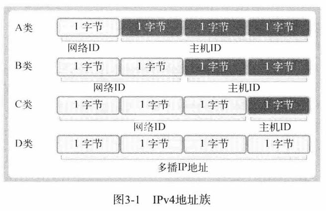

# book notes

## socket 创建

构造:

```c++
SOCKET socket(int af, int type, int protocol)
```

### 协议族(PF)

### 类型

#### 面向连接

即`SOCK_STREAM`, 其特点为:

- 按顺序

- 可靠

- 无边界

  - 分批send(发送)
  - 一次read(接收)

  ps: TCP将数据视为连续的字节流, 而非独立的消息包

#### 面向消息

即`SOCK_DGRAM`, 其特点为:

- 快速
- 不可靠
- 有边界
- 限制传输的大小

### 协议

## 为socket分配IP/port

> 只有通过IP和port下能将数据传送到最终的**应用程序**

IPv4地址族:



IPv4与IPv6的区别为所用的字节数

向相应的网络传输数据实际是想构成网络的Router和Switch传送数据, 再由接收数据的Router将数据传送给目标主机

端口号为同一OS内为区分不同的套接字而设置的, 无法将同一个端口分配给不同的套接字, 其中0~1023为知名端口, 分配给特定的程序, 但是值得注意的是, 因为TCP和UDP不会共用端口号, 所以允许重复

### 地址信息表示

#### IPv4地址的结构体

```cpp
struct sockaddr_in {
	short	sin_family;		// 地址族
	u_short	sin_port;       // 16bit TCP/UDP端口号
	struct in_addr	sin_addr;   // 32bit ip地址
	char	sin_zero[8];    	// 不使用
};
```

- `sin_family`: 

  **AF_INET**: IPv4协议中使用

- `sin_port`:

  16位端口号, 以**网络字节序保存**

- `sin_addr`:

  32位IP地址信息, **网络字节序保存** 

  为了分配IP地址, 需要将其表示为32位整数型数据, 而我们熟知的IP地址是**点分十进制表示法**, 这个函数会将字符串类型的IP转换为32bit整数, 桶式字节序转换:

  ```c++
  in_addr_t inet_addr (const char *);
  ```

  应用代码:

  ```c++
  serv_addr.sin_family = AF_INET;
  serv_addr.sin_addr.s_addr = inet_addr(argv[1]);		// 转换
  serv_addr.sin_port = htons(atoi(argv[2]));
  ```

  


其中的`in_addr`: 

- win:

```c++
typedef struct in_addr {
  union {
    struct { u_char  s_b1, s_b2, s_b3, s_b4; } S_un_b;
    struct { u_short s_w1, s_w2; } S_un_w;
    u_long S_addr;
  } S_un;
} IN_ADDR, *PIN_ADDR, *LPIN_ADDR;
```

- linux:

  ```c++
  typedef uint16_t in_port_t;
  typedef uint32_t in_addr_t;
  struct in_addr { in_addr_t s_addr; };
  ```

为32bit IPV4地址

### bind参数传递

注意到**bind**的参数传递:

```c++
int bind (int, const struct sockaddr *, socklen_t);
```

其中的第二个参数希望得到`sockaddr`的地址, 即

```c++
struct sockaddr {
	sa_family_t sa_family;
	char sa_data[14];
};
```

产生`sockaddr_in`的原因, 为了便于写出规范的地址信息, 如果使用`sa_data`则包含地址信息十分麻烦(14表示14字节)

## 网络字节序/地址变换

CPU保存数据由于大小端的关系导致内存空间的保存顺序不同, 如果不指定则会导致接收数据解析顺序不同, 具体体现在两台主机的主机字节序不同传送数据, 其解决方法就是**约定网络字节序**(Network Byte Order), 即先把数据数组转换为大端序格式再进行网络传输

字节序转换的函数如下:

```c++
uint32_t htonl(uint32_t);
uint16_t htons(uint16_t);
uint32_t ntohl(uint32_t);
uint16_t ntohs(uint16_t);
```

- `h`: host字节序
- `n`: network字节序

`htons`: `h`, `to`, `n`, `s`(short)

只有向`sockaddr_in`结构体变量填充数据时需要考虑字节序问题

具体代码为:

```c++
serv_addr.sin_family = AF_INET;
serv_addr.sin_addr.s_addr = htonl(INADDR_ANY);
serv_addr.sin_port = htons(atoi(argv[1]));				// 转换

if (bind(serv_sock, (sockaddr*)&serv_addr, sizeof(serv_addr)) == -1)
    ErrorHandling("bind() error");
```

测试:

```c++
#include<stdio.h>
#include <arpa/inet.h>

int main()
{
    char* addr = "1.2.3.4";
    char* addr2 = "1.2.3.256";

    unsigned long conv_addr = inet_addr(addr);
    if(conv_addr == INADDR_NONE)
        printf("Error!\n");
    else
        printf("Network ordered integer addr: %#1x \n", conv_addr);
    

    unsigned long conv_addr2 = inet_addr(addr2);
    if(conv_addr2 == INADDR_NONE)
        printf("Error!\n");
    else
        printf("Network ordered integer addr: %#1x \n\n", conv_addr2);

        return 0;
}
```

输出:

```bash
/home/NetProgramming/chap3 # ./test
Network ordered integer addr: 0x4030201 
Error!
```

不仅可以转化, 还可以检验无效的IP


另一个等同效果的函数为:

```c++
int inet_aton (const char *, struct in_addr *);
```

- 参数1: 需要转化的IP地址信息的字符串地址值
- 参数2: 保存转换结果的地址

它的使用频率更高

实例:

```c++
char* addr = "127.232.124.79";
struct sockaddr_in addr_inet;
if(!inet_aton(addr, &addr_inet.sin_addr))
    ErrorHandling("conversion Error");
else
    printf("NetWork ordered integer addr: %#x \n", addr_inet.sin_addr.s_addr);

```


下面这个函数将网络字节序整数型IP地址转换成字符串:

```c++
char *inet_ntoa (struct in_addr);
```

使用:

```c++
struct sockaddr_in addr1, addr2;
char* str_ptr;
char str_arr[20];

addr1.sin_addr.s_addr = htonl(0x1020304);
addr2.sin_addr.s_addr = htonl(0x1010101);

str_ptr = inet_ntoa(addr1.sin_addr);
strcpy(str_arr, str_ptr);
printf("Dotted-Decimal notation: %s \n", str_ptr);

inet_ntoa(addr2.sin_addr);
printf("Dotted-Decimal notation2: %s \n", str_ptr);
printf("Dotted-Decimal notation3: %s \n", str_arr);
```

结果:

```bash
/home/NetProgramming/chap3/build # ./test
Dotted-Decimal notation: 1.2.3.4 
Dotted-Decimal notation2: 1.1.1.1 
Dotted-Decimal notation3: 1.2.3.4 
```

### 网络地址初始化

```c++
sockaddr_in serv_addr;
memset(&serv_addr, 0, sizeof(serv_addr));		// 结构体变脸addr的所有成员初始化为0
serv_addr.sin_family = AF_INET;
serv_addr.sin_addr.s_addr = inet_addr(argv[1]);		// 基于字符串的IP地址初始化
serv_addr.sin_port = htons(atoi(argv[2]));			// 基于字符串的端口号初始化
```

## 客户端服务端地址信息初始化

客户端的请求: 请连接到IP: xxxxxx, xxxx端口, 客户端调用`connet()`函数完成, 而服务端调用`bind()`函数

并且两者初始化结构体也不同:

- 服务端: 声明`sockaddr_in`, 初始化为赋予服务器端IP和端口号
- 客户端: 声明`sockaddr_in`, 初始化为要链接的服务器端套接字信息

### 使用INADDR_ANY

```c++
serv_addr.sin_addr.s_addr = htonl(INADDR_ANY);
```

自动获取运行服务器的IP地址, 不必亲自输入, 如果同一个计算机中分配多个IP地址(如ROUTRE, 普通计算机的IP数量与网卡数量相等), 只要端口号一致**就可以从不同的IP地址接收数据**, 且只有服务器或者带有一部分服务器功能的客户端这样使用

ps: 如果只有一个网卡, 直接使用`INADDR_ANY`, 服务器端套接字初始化中要有iP地址信息(要知道是从哪个IP传来的)

如服务器端代码不用指定具体的iP地址就是因为使用了它:

```c++
sockaddr_in serv_addr;
memset(&serv_addr, 0, sizeof(serv_addr));
serv_addr.sin_family = AF_INET;
serv_addr.sin_addr.s_addr = htonl(INADDR_ANY);			// 使用 INADDR_ANY
serv_addr.sin_port = htons(atoi(argv[1]));
```

## 套接字分配网络地址

```c++
int bind (int, const struct sockaddr *, socklen_t);
```

此函数调用成功, 将第二个参数指定的地址信息分配给第一个参数相应的套接字

具体应用:

```c++
int serv_sock = socket(PF_INET, SOCK_STREAM, 0);	// 创建服务器端套接字
...
if (bind(serv_sock, (sockaddr*)&serv_addr, sizeof(serv_addr)) == -1)
    ErrorHandling("bind() error");
```


