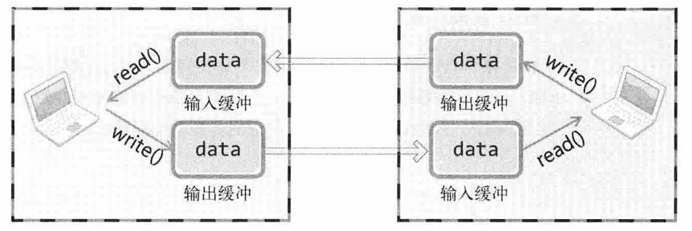

# tcp 服务器端/客户端

## TCP/UDP

TCP面向连接, 又称基于**流**(stream)的套接字

### 协议栈


这样的分层结构通过**标准化**操作设计了开放式系统

#### 链路层

**物理连接领域标准化**的结果, 定义LAN, WAN, MAN等标准, 即进行**物理连接**

#### IP层

向目标传输数据所经过的**路径的选择**, 面向消息, 不可靠, 如果发生数据丢失或错误则无法解决

#### 应用层

根据程序的特点决定服务器和客户端之间的数据传输规则

## 基于TCP的服务端/客户端

只有调用`listen()`函数进入**等待链接请求状态**, 此时客户端才能调用`connet()`, 否则提前调用会发生错误

### 等待连接请求状态

客户端请求连接时, 受理连接前一直使请求处于等待状态, 服务器端套接字是接收连接请求的**门卫**


`listen()`函数:

```c++
int listen (int sock, int backlog);
```

- 第一个参数: 

  传递文件描述符**套接字**, 调用`listen`可以生成门卫(监听套接字)

- 第二个:

  决定了等候室(即连接的请求等待队列)的大小, 与服务器的特性有关

### 受理客户端的链接请求

服务器端的套接字是作首尾的, 交换数据时不使用这个套接字, 这时需要另一个套接字, 使用`accept()`会自动创建另外一个套接字, 用来连接到发起请求的客户端

```c++
int accept (int sock, struct sockaddr *__restrict addr, socklen_t *__restrict addrlen);
```

使用:

```c++
int clnt_sock = accept(serv_sock, (sockaddr*)&clnt_addr, &clnt_addr_size);
```


处理在请求连接队列中的待处理客户端连接请求, 调用成功则产生**用于数据I/O的套接字**, 并返回其文件描述符

### 客户端与服务端的区别

客户端的区别就是**请求连接**, 使用`connect()`发送连接请求

```c++
int connect (int sock, const struct sockaddr * servaddr, socklen_t addrlen);
```

注意连接请求发出后并不一定意味着服务器端调用`accept()`, 而仅仅是放到了等待队列中, 并不立即进行数据交换

>注意: 客户端没有调用`bind()`, 不是没有分配iP和端口, 而是在调用`connet()`时在OS内核中使用计算机的iP和任意分配的端口


### 客户端与服务端的关系


注意只有服务器端调用`listen()`后客户端才能调用`connect()`, 并且如果客户端没有调用`connect()`, 服务端已经进行到了`accept()`则阻塞.


## 迭代服务器端

最简单的方法就是服务器使用**循环**调用`accept()`

服务器端将接受到的信息传回客户端即**回声**

这样可以实现简单的回声(client)

```c++
while(1){
    fputs("Input message(Q to quit): ", stdout);
    fgets(message, BUF_SIZE, stdin);

    if(!strcmp(message, "q\n") || !strcmp(message, "Q\n"))
        break;

    write(sock, message, strlen(message));
    str_len = read(sock, message, BUF_SIZE - 1);
    message[str_len] = 0;
    printf("Message from server: %s", message);
}
```

但这也会出现问题, 因为理想状态为每次调用`write()`, `read()`都会以字符串为单位执行I/O, 但是由于TCP不存在数据边界(即向流水线一样连续, 没有明确的分隔标记), 所以可能多次`write()`传递的字符串有可能一次性传输到服务器(即**没有分隔**), 此时客户端可能从服务端接收到多个字符串, 举例:

> - 你快速连续说了"你好"和"再见"（调用了两次write）
> - 但服务器可能把这两句话一起传回来（"你好再见"）
> - 你的read()会一次性收到全部内容，而不是分开的两句话

同样也有可能在服务器端由于传输数据太长而需要分两个数据包发送, 这样就会导致客户端没有收到全部的数据包就会调用`read()`.

### 改进方法

可以提前确定接收数据的方法, 即: 如果之前传输了20B的字符串, 那么循环接时调用`read()`读取20B即可.即: 接收的数据大小应该和发送的数据大小相等

改进代码:

```c++
str_len = write(sock, message, strlen(message));

recv_len = 0;
while(recv_len < recv_cnt){        // means: size of recursive recieve data should equal to which transfered before
    recv_cnt = read(sock, &message[recv_len], BUF_SIZE - 1);
    if(recv_cnt == -1)
        ErrorHandling("read() error");
    recv_len += recv_cnt;
}
```

## 实现一个客户端/服务端计算器

但是大多数情况不会提前知道数据长度, 这时就需要应用层协议的定义, 即**为特定的程序实现特定的规则**

实现一个计算器服务端/客户端:

- 首先应该确定协议:
  - 首先传递运算数的个数(1Bint)
  - 发送的操作数和接收的运算结果为int(4B)
  - 发送的OP为char(1B)

具体体现在:

```c++
// 相同的宏
#define BUF_SIZE 1024
#define OPSZ 4
#define RLT_SIZE 4
```

client:

```c++
int input_nums;
char message[BUF_SIZE] = {0};

std::cout << "Operator counts: ";
std::cin >> input_nums;
message[0] = (char)input_nums;

for (int i = 0; i < input_nums; i++) {
    std::cout << "Operand " << i + 1 << ": ";
    int num;
    std::cin >> num;
    memcpy(&message[i * OPSZ + 1], &num, sizeof(int));  // 正确存储int
}

std::cin.ignore();  // 清除输入缓冲区
std::cout << "Operator (+, -, *, /): ";
char op;
std::cin >> op;
message[input_nums * OPSZ + 1] = op;

// 发送整个消息
write(sock, message, input_nums * OPSZ + 2);

// 接收结果
int result;
read(sock, &result, sizeof(int));

std::cout << "Operation result: " << result << std::endl;
close(sock);
```

server:

```c++
int compute(char message[]) {
    int input_num = (unsigned char)message[0];  // 避免符号扩展
    char op = message[input_num * OPSZ + 1];
    int result = 0;

    if (input_num == 0) return 0;

    // 读取第一个操作数
    memcpy(&result, &message[1], sizeof(int));

    for (int i = 1; i < input_num; i++) {
        int operand;
        memcpy(&operand, &message[i * OPSZ + 1], sizeof(int));
        switch (op) {
            case '+': result += operand; break;
            case '-': result -= operand; break;
            case '*': result *= operand; break;
            case '/':
                if (operand == 0) {
                    std::cerr << "Error: Division by zero!" << std::endl;
                    return 0;
                }
                result /= operand;
                break;
            default:
                std::cerr << "Error: Invalid operator!" << std::endl;
                return 0;
        }
    }
    return result;
}
```

```c++
while (true) {
    int clnt_sock = accept(serv_sock, (sockaddr*)&clnt_addr, &clnt_addr_size);
    if (clnt_sock == -1)
        ErrorHandling("accept() error!");

    char message[BUF_SIZE];
    read(clnt_sock, message, BUF_SIZE);

    int result = compute(message);
    write(clnt_sock, &result, sizeof(int));

    close(clnt_sock);
}

close(serv_sock);
```

> ps: 编码中出现的问题:
>
> - 首次写的时候没有注意到使用`message`传递时应该用`int`型, 即需要`(int*)&message[i * OPSZ + 1]`的`scanf`输入, 当然, 也可以先`cin`个`int`然后再用`memcpy`将`int`复制到message的正确位置
> - 确定客户与服务端的协议真的很重要, 因为消息怎样传递就该怎样接收, 否则传递的信息就是无规律的bit流


## TCP原理

### TCP中的I/O缓冲

TCP的数据收发无边界, 可能分批次收和发

`write()`调用后并非立即传递数据, `read()`调用后也并非接收数据, 调用后都会将(从)数据发(读)缓冲区



一个重要的结论:

**不会发生超过输入缓冲大小的数据传输**

因为TCP会控制数据流, 为它的**滑动窗口协议(sliding window)**, 所以TCP不会因为缓冲溢出而丢失数据


`write()`函数返回的时机:

> 当应用程序调用 `write` 或 `send` 时，函数会**立即将数据复制到内核的发送缓冲区（输出缓冲）**，然后**立即返回**。
> **此时数据尚未真正发送到网络**，更未到达对方主机。
>
> - 函数的返回仅表示数据已成功交给操作系统内核，**不保证对方已收到数据**。
> - 这是为了提高效率：应用程序无需等待网络传输完成即可继续执行。

这样做可以优化性能, TCP在后台处理传输细节(相当于I/O操作与CPU并行执行)


### 与对方套接字的链接

TCP的三次握手:


- SYN: 收发数据前传递的同步消息, 为**首次请求连接**时的消息
- SEQ: 如SEQ 2000: 现传递2000的数据包, 如果接受无误, 通知我向你传递2001的数据包
- ACK: 如ACK 1001: 刚才传递的SEQ 1000的数据包接受无误, 请传递SEQ为1001的数据包

套接字以全双工工作, 可以双向传递数据

### 与对方主机数据交换

计算公式:

> ACK = SEQ  + 传递的字节数 + 1

加1是为了告知对方下次需要传递的SEQ号

如果传输包失效, 即经过超时长度后没有收到ACK确认, 则重传

### 断开连接

四次握手:


- FIN: 断开连接
- B向主机传递了两次ACK 5001, 因为第二次FIN包中的ACK 5001是因为接受ACK消息后为接受数据而重传的

完整的过程以及函数对应:


