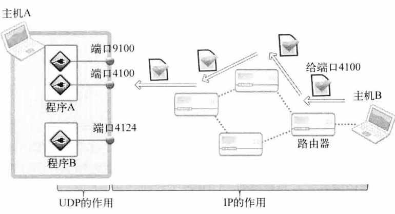
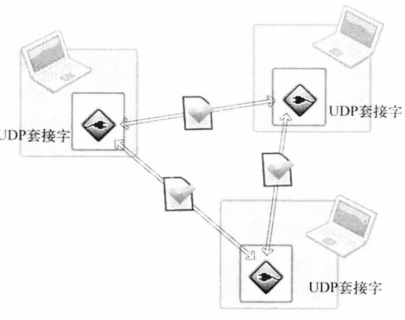

# UDP

与TCP不同, UDP不会进行流控制, 无需经过连接过程, 只有创建套接字和数据交换



UDP最重要的就是**根据端口号**传到主机的数据包交付到最终的UDP套接字

TCP慢于TCP的原因:

- 收发数据前后进行的链接设置及清除过程
- 接发数据中为保证可靠性而添加的流控制

如果收发的**数据量小但需要频繁连接**时UDP比TCP更高效


## 套接字关系

TCP中, 套接字之间一一对应, 如果要向10个客户端提供服务, 则除守卫之外还要10个服务端套接字

UDP中客户端和服务端仅需要1个即可, 就像收发信件的邮筒各方仅需要1个即可. **只需要1个UDP套接字就可以向任意的主机传递数据, 一个UDP套接字可以和多台主机通信**



## UDP I/O函数

TCP创建连接就无需添加地址信息, UDP每次传输数据树妖添加目标地址信息(寄信时需要加上地址)


传输数据:

```c++
ssize_t sendto (int sock, const void * buff, size_t nbytes, int flags, const struct sockaddr * to, socklen_t addrlen);
```

- `to`: 存有目标地址信息的`sockaddr`结构体变量的地址值 

这也是与TCP输出函数最大的区别: 此函数需要向他传递目标地址的信息


接收数据:

```c++
ssize_t recvfrom (int sock, void *__restrict buff, size_t nbytes, int flags, struct sockaddr *__restrict from, socklen_t *__restrict addrlen);
```

实例:

- 客户端:

  ```c++
  serv_sock = socket(PF_INET, SOCK_DGRAM, 0);
  if(serv_sock == -1)
      ErrorHandling("socket() error!");
  
  memset(&serv_adr, 0, sizeof(serv_adr));
  serv_adr.sin_family = AF_INET;
  serv_adr.sin_addr.s_addr = htonl(INADDR_ANY);
  serv_adr.sin_port = htons(atoi(argv[1]));
  
  if(bind(serv_sock, (struct sockaddr*)& serv_adr, sizeof(serv_adr)) == -1)
      ErrorHandling("bind() error!");
  
  
  /////////////
  // 和tcp一样
  
  while(1) {
      clnt_adr_sz = sizeof(clnt_adr);
      str_len = recvfrom(serv_sock, message, BUF_SIZE, 0,
                         (sockaddr*)& clnt_adr, &clnt_adr_sz);
      sendto(serv_sock, message, str_len, 0,
             (sockaddr*)& clnt_adr, clnt_adr_sz);
  }
  
  // 实际不会执行到这里
      close(serv_sock);
  ```

  
